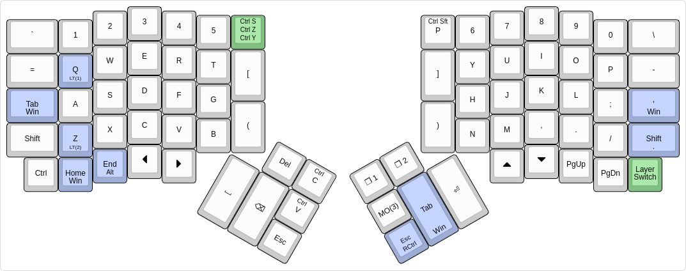
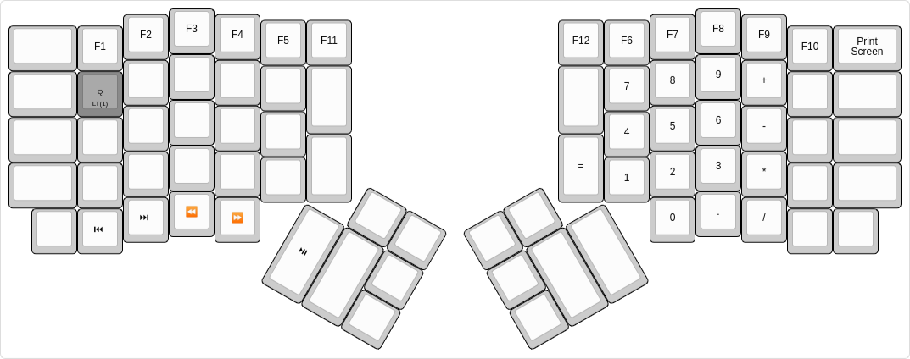

# iynaix's layout

My layout for the [ErgoDox EZ][ez].

[ez]: https://ergodox-ez.com/

# Layouts

## Base

[](http://www.keyboard-layout-editor.com/#/gists/121345505ed2f8dfb2f0733407c08076)

-   The blue `Shift`, `Ctrl`, `Alt` and `Win` modifiers are mod-tap keys. When tapped, they perform as expected. When held, they function as the respective modifiers.
-   The green keys are tap dance keys. Tap once for the top command, twice for the second command and thrice for the third command.
-   The green layer switch key switches to the base layer on a single tap or hold, the numpad layer on 2 taps, and the navigation layer on 3 taps.

## Numpad Layer

[](http://www.keyboard-layout-editor.com/#/gists/121345505ed2f8dfb2f0733407c08076)

## Navigation Layer

[](http://www.keyboard-layout-editor.com/#/gists/e210f0b9dc6951748a4aa7511688b79e)

Contains keys for navigation by mouse and a set of arrow keys oriented in the regular fashion.

## Macro Layer

[](http://www.keyboard-layout-editor.com/#/gists/6632ee175b508fd975c53c0555c8f70b)

- `s` types `¯\_(ツ)_/¯`
- `l` types `( ͡° ͜ʖ ͡°)`.
- `t` types `(╯°□°）╯︵ ┻━┻`.

# Building

To build it, you will need the [QMK][qmk] firmware checked out, and this directory symlinked to something like `layouts/community/ergodox/iynaix`, or symlinked there. One way to achieve that is this:

[iynaix:ez-layout]: https://github.com/iynaix/ergodox-layout
[qmk]: https://github.com/qmk/qmk_firmware

```

$ git clone https://github.com/qmk/qmk_firmware.git
$ git clone https://github.com/iynaix/ergodox-layout.git
$ ln -s ergodox-layout qmk_firmware/layouts/community/ergodox/iynaix
$ cd qmk_firmware
$ make ergodox_ez:iynaix:hex
$ teensy-loader-cli -v -mmcu=atmega32u4 -w ergodox_ez_iynaix.hex
```
